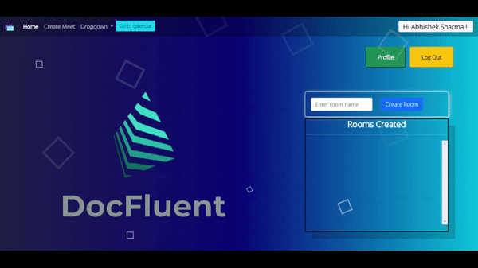
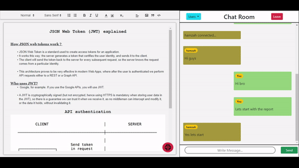
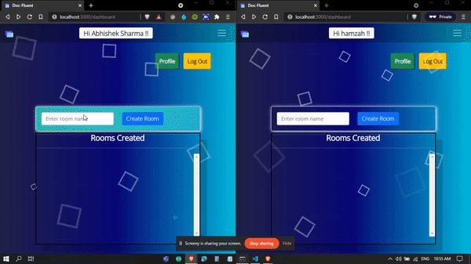
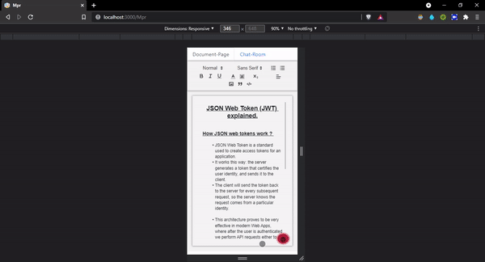
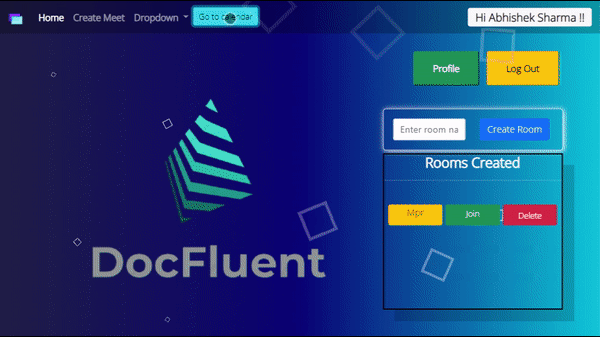
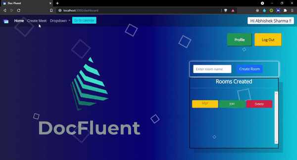

<h1 align="center"> 

 **Doc-Fluent** 

</h1>

## Hello Everyone! 
<h4>

Writing a group report or preparing collaborative documents is a tedious task as it requires to have a different platform for composing a multiparty Google Docs, a platform for communication and a different platform for hosting meets. 

With DocFluent, collaboration with your teammates will be easier than ever before, Host a meet, prepare a doc and even chat with your teammates, all in one place!
 
 

<h4>
    DocFluent is an attempt to combine google doc with chat application feature. 
</h4>

 Note : The fully-functional code is located in the devEnv branch of this repo. 

# **Tech Used**
- CSS3
- [EJS](https://ejs.co/)
- [Bootstrap](https://getbootstrap.com/)
- [Express](https://expressjs.com/)
- Socket.IO
- [Firebase](https://firebase.google.com/)
- [Quill.js](https://quilljs.com/)
- [JsonWebToken](https://jwt.io/)

 

# **Features explained**
 

## *Create Rooms*

Here you can create rooms which provides you with a editor for reports and a chatting interface.

 

## *Responsiveness*

The rooms are responsive to some extent where the layout switches to tabs mode when the width crosses certain threshold. 

 

## *Synchronisation*

The changes are visible to each user in the room. The file data  can also be saved into your local machine.  

 

## *Functionalities*

- ## Saving files
    
 

* ## Calendar
    
 

* ## Create instant meet
    
    
 

# **Authentication**

Used firebase authentication and realtime database to store the usernames. 

 

# **Contributors**
<strong>

- [Abhishek Sharma](https://github.com/Abhi-tech-09)
    - [LinkedIn](https://www.google.com)

</strong> 
